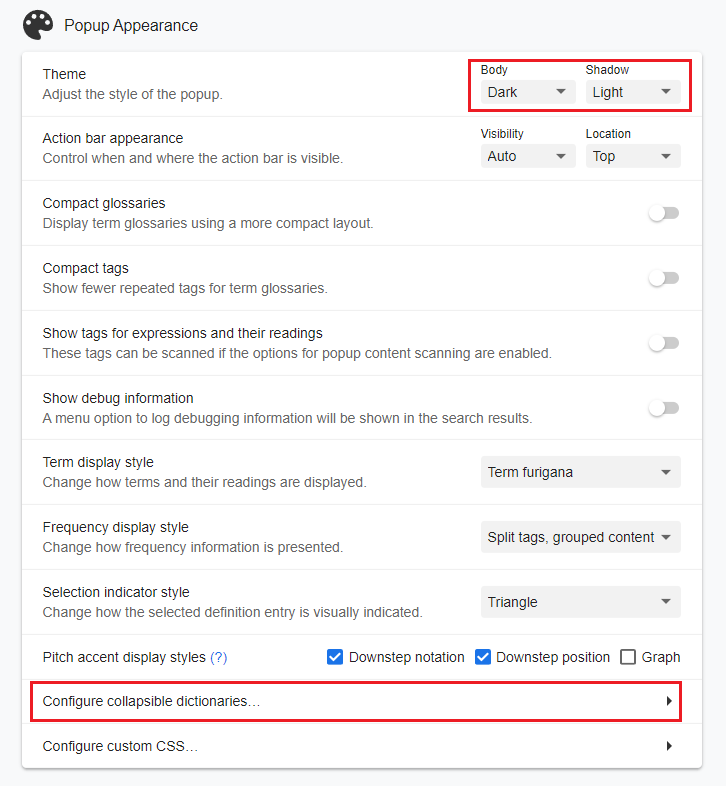

import Tabs from '@theme/Tabs';
import TabItem from '@theme/TabItem';

Sin importar la etapa en la que se encuentre o la dificultad del contenido que esté consumiendo, tarde o temprano se verá en la obligación de usar un diccionario japonés. Ya sea para conocer una lectura o para entender el significado de una palabra.

## ¿Qué es Yomichan?
Yomichan es una extensión de navegador que le permitirá consultar uno o varios diccionarios al tiempo para una sola palabra permitiendo que pueda ver su significado y lectura en cualquier momento. Todo desde cualquier sitio web. Yomichan cuenta también con funciones extras como integración con Anki que le permitirá ahorrar tiempo en su aprendizaje.

## Instalación Yomichan
Esta herramienta se encuentra disponible para cualquier navegador web basado en Chromium y Firefox. Para dispositivos móviles sólo es posible instalar Yomichan en Android a través de algún navegador que soporte el uso de extensiones como Kiwi Browser. Enlaces de la extensión aquí abajo para cada plataforma.

- [Chromium](https://chrome.google.com/webstore/detail/yomichan/ogmnaimimemjmbakcfefmnahgdfhfami)
- [Firefox](https://addons.mozilla.org/en-US/firefox/addon/yomichan/)

Navegadores para dispositivos móvles compatibles con extensiones:
- [Kiwi Browser](https://play.google.com/store/apps/details?id=com.kiwibrowser.browser) (Android)

## Primeros pasos
### Diccionarios
Una vez instalado Yomichan se abrirá una nueva pestaña de forma automática. La cerramos. Nuestro primer paso será instalar los diccionarios ya que, por defecto, Yomichan no cuenta con diccionarios instalados. A continuación podrá encontrar el link de descarga donde podrá encontrar todos los diccionarios disponibles en Yomichan para el idioma japonés:
- [Paquete de diccionarios](https://learnjapanese.link/dictionaries)

:::note Información
Los diccionarios son proporcionados por [TheMoeWay](https://learnjapanese.moe/)/Shoui.
:::

Estos son los diccionarios que, según su caso, debe descargar. Si desea conocer en detalle qué hace cada diccionario, <a href="../utility/Diccionaries">aquí</a> encontrará más información.

<Tabs className="unique-tabs">
  <TabItem value="apple" label="Diccionarios para principiantes" default>

Los diccionarios que encontrará en esta sección contienen definiciones únicamente del Japonés al Inglés.

**Carpeta Bilingual:**
<li><code>[Bilingual] JMdict (English).zip</code></li>
<li><code>[Bilingual] 研究社　新和英大辞典　第５版.zip</code></li>
<li><code>[Bilingual] 新和英.zip</code></li>
 

**Carpeta Pitch Accent:**
<li><code>[Pitch Accent] アクセント辞典.zip</code></li>
 

**Carpeta Kanji:**
<li><code>[Kanji] KANJIDIC (English).zip</code></li>

  </TabItem>
  <TabItem value="orange" label="Diccionarios para Intermedios/Avanzados">

  **Carpeta Bilingual:**
  <li>Todos los diccionarios de esta carpeta.</li>

  **Carpeta Monolingual:**
  <li>Todos los diccionarios de esta carpeta.</li>

  </TabItem>

  <TabItem value="extras" label="Diccionarios extras" default>

  </TabItem>
</Tabs>

#### Instalación Diccionarios
Una vez descargue los diccionarios, se encontrará con varios archivos en formato .zip, estos son los diccionarios y **no deben ser extraídos**.

  1. Presione el icono de Yomichan en la barra de herramientas del navegador y después, presione el ícono de ajustes.
  2. Vaya al apartado “Dictionaries” y presione “Configure installed and enabled dictionaries...”. 
  3. Presione el botón “Import” y busque el directorio donde extrajo el paquete de diccionarios. Importe los diccionarios de su elección. 
  
Al ser muchas entradas y diccionarios, es normal que la importación lleve un tiempo. Pero con esto concluiría la instalación de diccionarios en Yomichan.

:::tip Orden de prioridad
Después de finalizado el proceso de importación podrá cambiar la prioridad de cada diccionario, es decir, qué diccionario verá primero. El número mayor que asigne será el primer diccionario que verá.

:::

### Configuración Ajustes Avanzados
Antes de probar Yomichan, haremos unos ajustes. Antes de seguir, verifique que tenga los ajustes avanzados activados en la esquina inferior izquierda como se aprecia en la imagen.

#### Popup
En el apartado Popup vamos a habilitar el escaneo dentro de las ventanas emergentes y eliminaremos el límite de ventanas emergentes. De esta forma podrá usar Yomichan con los diccionarios que ha importado cuantas veces quiera.

#### Popup Appearance
En el apartado de Popup Appearance vamos a hacer más agradable la interfaz de Yomichan. Aquí, de forma opcional, vamos a activar el modo nocturno. Y vamos a permitir que todos los diccionarios se puedan colapsar.

#### Popup Position & Size
En el apartado Popup Position & Size vamos a incrementar el tamaño de la ventana emergente para mejorar la nitidez del diccionario. Muy útil sobre todo cuando se usan diccionarios monolingües. Aquí muestro mis ajustes de preferencia pero puede cambiarlos y experimentar con otros apartados según sus preferencias.

#### Audio
En este apartado vamos a configurar las fuentes de donde se obtendrán los audios de cada palabra.

### Demostración
Sólo queda probar Yomichan con alguna palabra en Japonés. Para usar Yomichan basta con ir a cualquier sitio web y mantener presionado `SHIFT` mientras se pasa el cursor por alguna palabra que se quiera buscar en Yomichan. Puede experimentar con esta oración: みんな恋愛の話するの好きだもんな。

La ventana emergente de Yomichan quedará similar a esta imagen:

:::warning YOMICHAN EN PDFS
En navegadores basados en Chromium no es posible utilizar Yomichan en archivos PDFs.
:::
