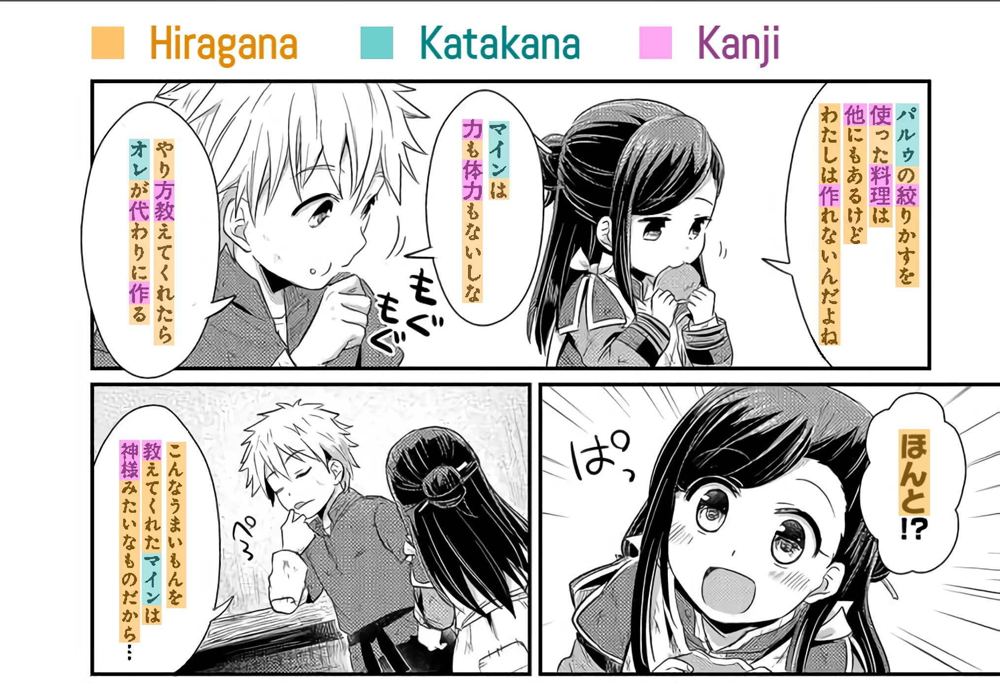
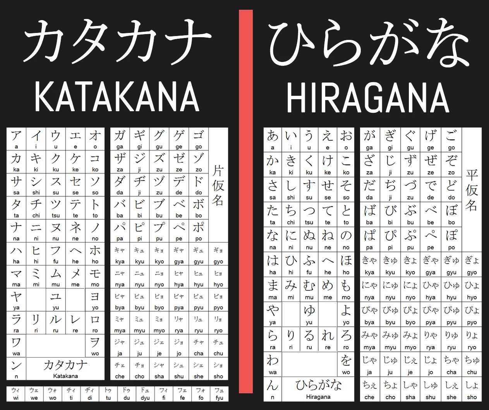
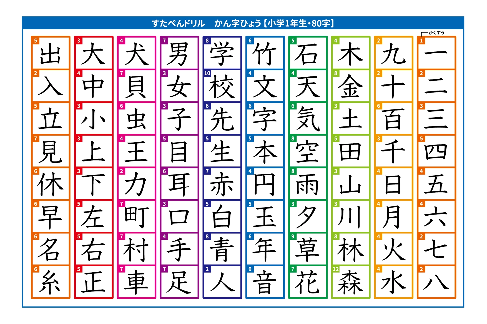
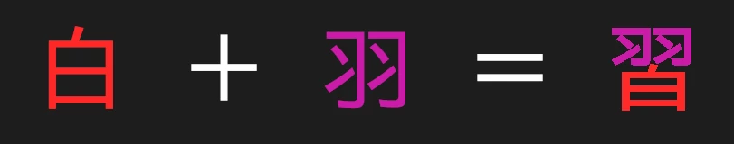
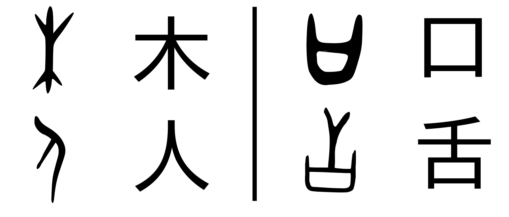

# Sistemas de escritura

El japonés, a diferencia de nuestro idioma español, se escribe con tres sistemas, diferentes en funcionamiento y estructura al alfabeto al que estamos acostumbrados. No es de preocuparse, ni de verlo como algo extraño; a través de un buen estudio, le llegarán a ser tan naturales como nuestro propio sistema. Pero antes de eso es importante entender qué son y qué no son estos sistemas.

<small><i>Los tres sistemas de escritura japoneses en uso en un manga </i>(本好きの下剋上)</small>

## Kana


<i><small>El katakana y el hiragana (kana)</small></i>

### ¿Qué son los kana?

«Kana» es un término que se refiere a dos sistemas de escritura que utiliza el japonés: el **katakana** y el **hiragana**. Ambos son silabarios, lo que significa que cada carácter representa, en vez de un solo sonido (como en nuestro alfabeto), una sílaba completa. Así, ambos incluyen un carácter o una combinación de estos para todas las sílabas que existen en el japonés moderno. Y esto con solo 46 caracteres por silabario. Bastante conveniente, ¿no?

Existe una razón por la que hay dos silabarios con caracteres distintos. Lo cierto es que ambos son idénticos en fonética y en funcionamiento: representan exactamente los mismos sonidos y las mismas sílabas, así que algo escrito en hiragana puede escribirse en katakana y sonaría de la misma manera. ¿Para qué tener ambos, entonces? La diferencia está en su modo de empleo. Por un lado, el **hiragana**, caracterizado por sus caracteres redondeados y estilizados, podría considerarse como el sistema principal, pues con él se escriben:
- Palabras de todo tipo (sustantivos, adjetivos, adverbios...)
- Terminaciones verbales, adjetivales y adverbiales (flexiones)

Por otro lado, el **katakana**, caracterizado por sus caracteres nítidos y puntiagudos, actúa como un sistema secundario con usos más específicos. Se suele usar para escribir:
- Nombres extranjeros (de personas, lugares...)
- Nombres de animales y plantas
- Palabras que se desean resaltar (por lo que se usa mucho en la publicidad)
- Palabras y pronunciaciones prestadas de otros idiomas

En teoría, uno podría escribir cualquier palabra o texto en japonés usando exclusivamente uno de estos dos silabarios. Sin embargo, esto no pasa (a excepción de en libros de niños). La razón es el tercer sistema de escritura, el **kanji**, que se explicará después.

### ¿Cómo aprender los kana?

El aprendizaje de los kana es un proceso flexible. Puede aprenderlos escribiéndolos en un papel, con aplicaciones o con cualquier otro método que le parezca cómodo. El número de caracteres puede parecer abrumador, pero descuide; los verá con tanta frecuencia, que aprenderlos será más fácil de lo que parece. Recomendamos estos recursos para hacerlo:
- [Guía corta para aprender hiragana](https://web.archive.org/web/20210227085809/http://www.aprenderjapones.com/curso-de-japones/hiragana-basico/): pequeña guía que explica las reglas y pronunciaciones del hiragana (archivado, sin audio).
- [Guía corta para aprender katakana](https://web.archive.org/web/20200223095407/http://www.aprenderjapones.com/curso-de-japones/katakana-basico): pequeña guía que explica las reglas y pronunciaciones del katakana (archivado, sin audio).
- [Hoja de hiragana](https://web.archive.org/web/20220530233345/http://japanese-lesson.com/resources/pdf/characters/hiragana_writing_practice_sheets.pdf): planas para aprender a escribir hiragana.
- [Hoja de katakana](https://web.archive.org/web/20220322012537/http://japanese-lesson.com/resources/pdf/katakana_writing_practice_sheets.pdf): planas para aprender a escribir katakana.

:::tip Consejo
Los kana son esenciales para leer japonés. Le recomendamos aprenderlos como su primer paso en el idioma.
:::


## Kanji

<small><i>Algunos kanji básicos que se enseñan a los japoneses en su primer año de escuela.</i></small>

El kanji es posiblemente el obstáculo más grande para los que queremos aprender a leer japonés. Lo rodean decenas de rumores y métodos de aprendizaje sin base y sin sentido, que solo lo hace parecer más difícil de lo que es en realidad. Esta guía es un intento de presentar el sistema de manera sencilla y precisa. 

El kanji puede parecer abrumador, pero no se preocupe. Al igual que con el kana, si se tienen unas buenas bases, aprenderlo se vuelve un proceso mucho más ameno y natural de lo que parece. Si alguna vez se siente desalentado y cree que es imposible aprenderlo, recuerde: **cientos de millones de personas han aprendido a entenderse y comunicarse con este sistema a través de la historia; usted no está condenado a ser la excepción**.

### ¿Qué es el kanji?

El kanji es un sistema de escritura logográfico. Lo que esto significa es que sus caracteres no representan sonidos, como nuestro alfabeto o los kana, sino palabras completas o morfemas (unidades lingüísticas **con significado**). Un ejemplo es el carácter 雨: por sí solo, significa «lluvia», y se lee «ame». Los kanji pueden representar cualquier tipo de palabra, algunas mucho más abstractas, como 凪, que se lee «nagi» y significa «un océano en reposo». En el japonés, las palabras usualmente se combinan para formar compuestos, como 雷雨 (raiu, «tormenta eléctrica»), que está compuesto de «relámpago» y su kanji (雷) y «lluvia», también con su kanji.

### El kanji y el japonés

El kanji ni siquiera es un sistema japonés, sino chino. Su mismo nombre, 漢字 (que literalmente es «china carácter»), lo indica. El kanji llegó a Japón alrededor del siglo 4 d. C., cuando la nación aún era analfabeta. Japón copió el sistema y lo adaptó para su propio idioma. Más tarde surgirían los kana y todo se consolidaría en el japonés moderno.

El problema con copiar un sistema extranjero fue el hecho de que, aparte de sus significados, los caracteres chinos ya tenían lecturas chinas usadas en palabras chinas que el japonés también adoptó. Sin embargo, el japonés también tenía sus propias palabras con lecturas japonesas. Resolvieron asignarle dos lecturas a cada carácter: la china y la japonesa. Respectivamente, estas hoy en día se conocen como 音読み (on'yomi, «lectura fonética») y 訓読み (kun'yomi, «lectura semántica»), y se usan de forma simultánea.

Como regla general, el **on'yomi** se utiliza en palabras compuestas de más de un carácter. A continuación varios ejemplos que muestran la palabra, su significado, su lectura en on'yomi japonés y su lectura en mandarín estándar para comparar cómo cambiaron las lecturas chinas en el japonés:
```
番号　| número		| bangō		| fānhào
勉強　| estudiar	| benkyō	| miǎnqiǎng
病院　| hospital	| byōin		| bìngyuàn
地図　| mapa		| chizu		| dìtú
雷雨　| tormenta	| raiu		| léiyǔ
```
Puesto que estas son lecturas originalmente chinas, los diccionarios listan los on'yomi de los kanji usando katakana.

Por otro lado, el **kun'yomi** se utiliza en verbos, adjetivos, adverbios, prefijos, sufijos, sutantivos y demás, usualmente cuando hay un solo carácter. Básicamente, en cualquier palabra de origen japonés. Sin embargo, debido a las gramáticas distintas del japonés y del chino, el kanji tuvo que adaptarse para palabras japonesas, por lo cual es común ver una combinación de kanji y hiragana: en los verbos y los adjetivos, por ejemplo, este hiragana indica la terminación verbal que cambia con la conjugación. A continuación ejemplos con la palabra con el kanji, el significado, su lectura en japonés y su categoría gramatical:
```
読む　　　| leer		| yomu		| verbo
嬉しい　　| feliz	| ureshii	| adjetivo
話す　　　| hablar	| hanasu	| verbo
雨　　　　| lluvia	| ame		| sustantivo
私　　　　| yo		| watashi	| pronombre
落ち込む　| caer		| ochikomu	| verbo
```
En el último ejemplo vemos cómo también dos verbos (落ちる, ochiru, y 込む, komu) a veces se unen para formar compuestos de múltiples caracteres, pero que utilizan el kun'yomi. Esto se puede reconocer fácilmente, pues el hiragana se mantiene en estos compuestos, como se ve en 落**ち**込**む**.

### Estructura del kanji

El kanji puede parecer excesivamente complicado y aleatorio en su escritura, pero no es así. La mayoría de caracteres, solo exceptuando los más básicos, se pueden descomponer en componentes más pequeños y sencillos, que en la mayoría de los casos nos permiten saber de la historia, significado y pronunciación del carácter. Estos componentes comúnmente reciben el nombre de «**radicales**». Abajo un ejemplo que ilustra el concepto.

<small><i>Los radicales de 習: 白 y 羽</i></small>

Dependiendo de su composición radical (o falta de esta), se pueden clasificar, a grandes rasgos, los kanji en tres categorías:
- Pictogramas
- Compuestos semánticos
- Caracteres fonosemánticos

Los **pictogramas** por lo general son los caracteres más básicos. En un inicio eran representaciones visuales, dibujos, de los significados de sus palabras. La mayoría ha perdido su semejanza a lo que representaban debido a milenios de cambios caligráficos, aunque no del todo.

<small><i>Formas primitivas y modernas de varios caracteres</i></small>

En la imagen de arriba se puede ver que 木 (moku, «árbol») era dibujado como un árbol con sus ramas y raíces; 人 (hito, «persona»), como una persona parada de lado; 口 (kuchi, «boca»), como una boca abierta; y 舌 (shita, «lengua»), como una lengua que sale de una boca.

Ahora, hay conceptos que no pueden ser representados literalmente por un dibujo, por lo menos no claramente. Es por esto que, a partir de los pictogramas, nacieron los **compuestos semánticos**: caracteres que combinan los significados de dos o más componentes para crear otro significado. Abajo algunos ejemplos de compuestos semánticos, con sus significados y explicaciones:
```
休　| descanso			| una persona (人) se recuesta sobre un árbol (木)
分　| porción, separar	| dos objetos (八) y un cuchillo (刀)
間　| intervalo, espacio	| la luz del sol (日) entre dos puertas (門) semiabiertas
```

Pero este tipo de caracteres también tiene sus problemas. Necesita crearse una combinación semántica nueva para cada uno, a lo que se le suma la asignación de una lectura. Si todos los caracteres fueran así, el kanji sería ridículamente difícil de aprender por su complejidad conceptual y gráfica, sin mencionar la cantidad de palabras. Por eso se inventaron los **caracteres fonosemánticos**.

**Los caracteres fonosemánticos constituyen la mayoría de los kanji**. Su lógica es similar a la de los compuestos semánticos; pero en vez de utilizar una combinación de dos caracteres por su significado, usan uno o más por su significado y otro por su **sonido**. Abajo un ejemplo de múltiples caracteres que ilustran esto, su significado con su radical semántico y su lectura on'yomi.
```
同　| igual　									| dō
筒　| cilindro (radical semántico: 竹, bambú)	| tō
銅　| cobre (radical semántico: 金, metal)		| dō
胴　| torso (radical semántico: 肉, carne)		| dō
桐　| paulonia (radical semántico: 木, árbol)	| tō
洞　| caverna (radical semántico: 水, agua)	| dō
```
Como se puede ver, hay un caracter inicial, 同, que se lee dō. En el chino, todas las palabras que le siguen tienen la misma pronunciación (como se ve en el on'yomi), por lo cual se crearon más caracteres diferenciados por un radical semántico, que contenían 同 como un indicador de pronunciación. Así se hace más fácil recordar la lectura.

### ¿Cómo aprender kanji?

Esta pregunta merece su propia sección, por lo que será tratada en *Vocabulario y kanji*.