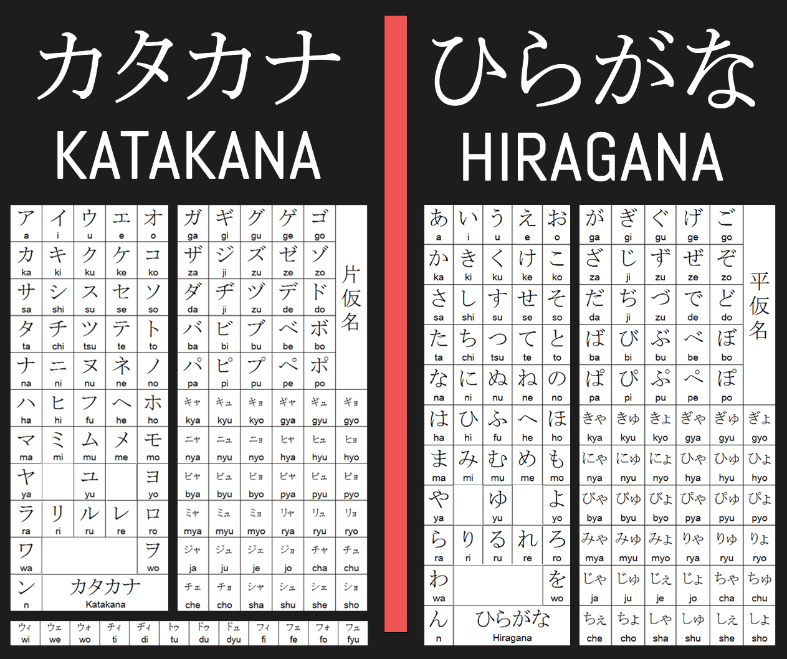
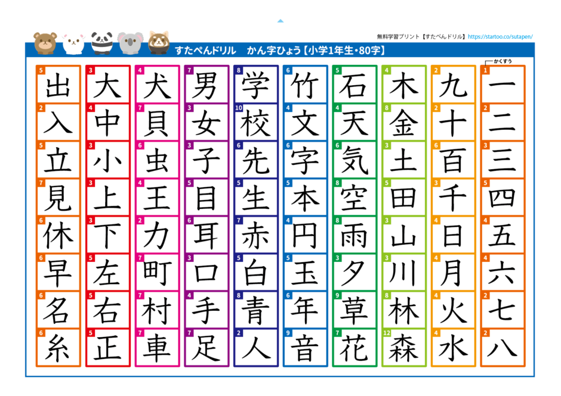
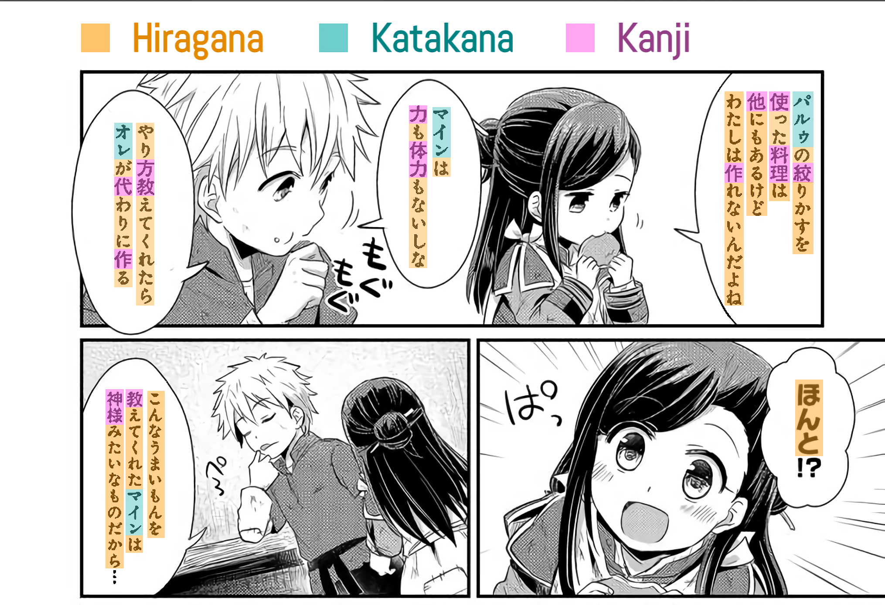

# Sistemas de escritura

El lenguaje japonés consta de tres sistemas de escritura principales: *hiragana*, katakana y *kanji*. Estos tres se utilizan en conjunto casi siempre, así que, antes de que pueda realizar inmersión o aprender cualquier otra cosa sobre el lenguaje, debe conocerlos, empezando por los **kana**.

## Kana

<i><small>Los dos silabarios japoneses (kana)</small></i>

El kana es un término que describe el conjunto de dos sistemas de escritura silábicos: el *hiragana* y el katakana. El primero se utiliza para escribir palabras o nombres cuyos *kanji* (caracteres chinos, se explicarán más tarde) son muy complicados o no se recuerdan, y para escribir [flexiones](https://es.wikipedia.org/wiki/Flexi%C3%B3n_(ling%C3%BC%C3%ADstica)) (por ejemplo, de verbos), entre otras cosas. El segundo se utiliza para escribir nombres de origen extranjero o en muchos casos para hacer la letra más llamativa (por eso gran parte de los anuncios comerciales japoneses contienen texto escrito en katakana).

### ¿Cómo puedo aprender los kana?
Por suerte, el aprendizaje de los kana es totalmente flexible. Puede aprenderlos a través de lapiz y papel, con aplicaciones o con cualquier método que le parezca cómodo. Aprender los kana puede parecer complicado por la cantidad, pero descuide; es más fácil de lo que aparenta en un inicio. En cuestión de **una o dos semanas aproximadas** debería ser capaz de aprenderlos. Para ello, puede hacer uso de cualquiera de estos recursos:

- [Guía corta para aprender *hiragana*](http://www.aprenderjapones.com/curso-de-japones/hiragana-basico/): pequeña guía que contiene y explica las reglas y pronunciaciones del *hiragana*.
- [Guía corta para aprender katakana](http://www.aprenderjapones.com/curso-de-japones/katakana-basico/): pequeña guía que contiene y explica las reglas y pronunciaciones del *katakana*.
- [Planas para *hiragana*](http://japanese-lesson.com/resources/pdf/characters/hiragana_writing_practice_sheets.pdf): planas para aprender a escribir *hiragana* (lapiz y papel).
- [Planas para katakana](http://japanese-lesson.com/resources/pdf/katakana_writing_practice_sheets.pdf): planas para aprender a escribir katakana (lapiz y papel).

Una vez haya aprendido los kana, puede realizar una pequeño prueba en la página de [DJT Kana](https://djtguide.neocities.org/kana/index.html) y de esa forma ver en qué necesita más repasos. No sea estricto, *no* busque la perfección. Si se equivoca rara vez, puede seguir con el resto de la guía. De aquí en adelante los kana los irá reforzando a medida que lea.

:::warning Advertencia
Debe aprender los kana antes de continuar con la guía. Evite el uso del *romaji* como un sustituto para ellos; es decir, evite transcripciones del japonés al alfabeto latino y utilice a como dé lugar los kana.
:::

## *Kanji*

<i><small>Algunos </i>kanji<i> básicos enseñados a los japoneses en su primer año de escuela</small></i>

El último y tercer sistema de escritura que hay en el lenguaje japonés es el *kanji*. Este es un sistema de escritura logográfico proveniente de China, que utiliza [logogramas](https://es.wikipedia.org/wiki/Logograma) (representaciones gráficas abstractas) para expresar ideas, conceptos, palabras, etc. Es quizás la barrera más grande para todo aprendiz debido a que hay una cantidad impresionante de ellos. En el sistema educativo japonés se enseñan 2136 *kanji*, pero en la vida diaria se utilizan alrededor de 3000 o más. Aun así, no se alarme ni pierda la esperanza. Aunque parezca una locura esa cantidad, eventualmente, entre más avance en el idioma y aprenda más palabras, dejan de suponer un reto. El motivo por el cual muchas personas fallan y desesperan es simplemente por la falta de un método eficiente para encararlos.

<i><small>Los tres sistemas de escritura siendo usados en un manga (</i>本好きの下苦情<i>)</small></i>

### ¿Cómo aprender *kanji*?
Esta es una pregunta muy frecuente, así como la oración «estoy aprendiendo kanji», pero niguna de las dos tiene sentido ni en el mejor de los casos. Sean totalmente nuevos en esto o no, antes de abarcar métodos y más información sobre el *kanji*, hay que aprender la diferencia entre *vocabulario* y *kanji*. Este tema es lo suficientemente extenso como para merecer su propia sección.
