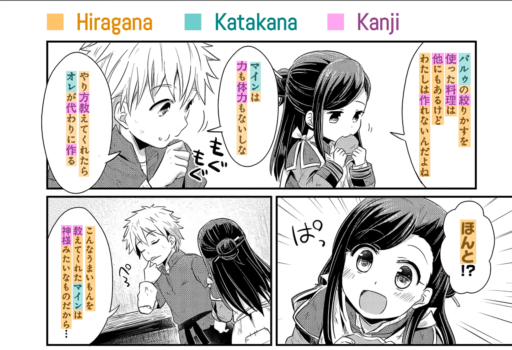
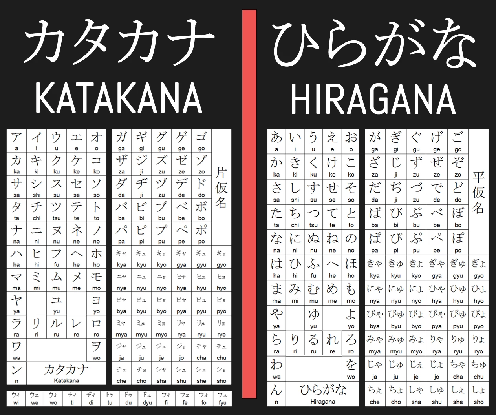
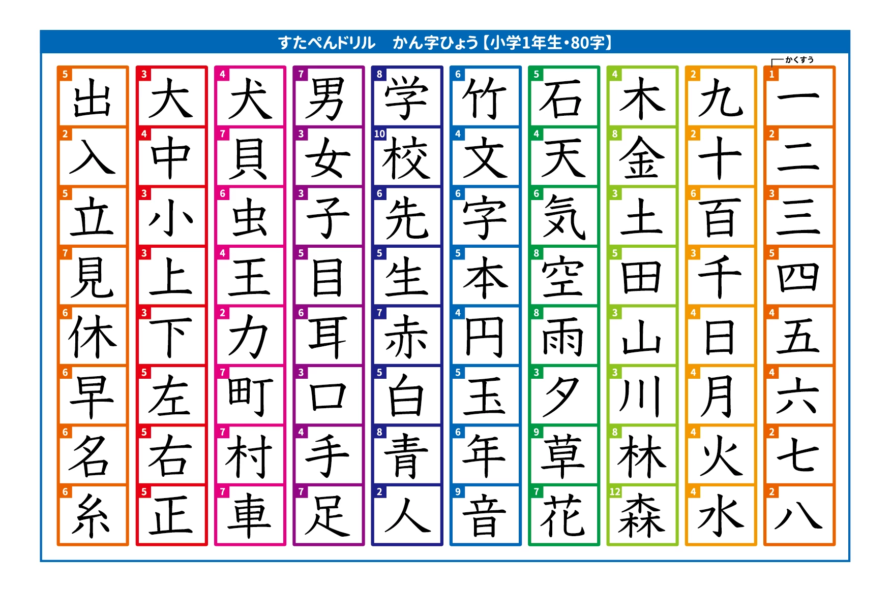
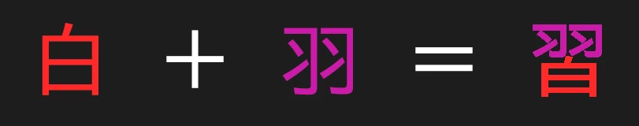
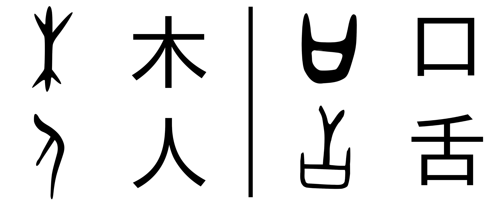

# Sistemas de escritura

El japonés, a diferencia de nuestro idioma español, se escribe con tres sistemas, diferentes en funcionamiento y estructura al alfabeto al que estamos acostumbrados. No es de preocuparse, ni de verlo como algo extraño; a través de un buen estudio, le llegarán a ser tan naturales como nuestro propio sistema. Pero antes de eso, es importante entender qué son y qué no son estos sistemas.

<small><i>Los tres sistemas de escritura japoneses en uso en un manga </i>(本好きの下剋上)</small>

## Kana


<i><small>El katakana y el hiragana (kana)</small></i>

### ¿Qué son los kana?

«Kana» es un término que se refiere a dos sistemas de escritura que utiliza el japonés: el **katakana** y el **hiragana**. Ambos son silabarios, lo que significa que cada carácter representa, en vez de un solo sonido (como en nuestro alfabeto), una sílaba completa. Así, ambos incluyen un carácter o una combinación de estos para todas las sílabas que existen en el japonés moderno. Y esto con solo 46 caracteres por silabario. Bastante conveniente, ¿no? Los kana son esenciales para entender la escritura japonesa.

Ahora, existe una razón por la que hay dos silabarios con caracteres distintos. Lo cierto es que ambos son idénticos en fonética y en funcionamiento: representan exactamente los mismos sonidos, las mismas sílabas; algo escrito en hiragana puede escribirse en katakana y sonaría de la misma manera. ¿Para qué tener ambos, entonces? La diferencia está en su modo de empleo. Por un lado, el **hiragana**, caracterizado por sus caracteres redondeados y estilizados, podría considerarse como el sistema principal, pues con él se escriben:
- Palabras de todo tipo (sustantivos, adjetivos, adverbios...)
- Terminaciones verbales, adjetivales y adverbiales (flexiones)

Por otro lado, el **katakana**, caracterizado por sus caracteres nítidos y puntiagudos, actúa como un sistema «secundario» con usos más específicos. Usualmente se utiliza para escribir:
- Nombres extranjeros (de personas, lugares...)
- Nombres de animales y plantas
- Palabras que se desea resaltar (por lo que se usa mucho en la publicidad)
- Palabras y pronunciaciones prestadas de otros idiomas

En teoría, uno podría escribir cualquier palabra o texto en japonés usando exclusivamente uno de estos dos silabarios. Sin embargo, esto no pasa (a excepción de en libros de niños). La razón es el tercer sistema de escritura, el **kanji**, que se explicará después.

### ¿Cómo aprender los kana?

El aprendizaje de los kana es un proceso flexible. Puede aprenderlos escribiéndolos en un papel, con aplicaciones o con cualquier otro método que le parezca cómodo. El número de caracteres puede parecer abrumador, pero descuide: los verá con tanta frecuencia, que aprenderlos será más fácil de lo que parece. Recomendamos estos recursos para hacerlo:
- [Guía corta para aprender hiragana](https://web.archive.org/web/20210227085809/http://www.aprenderjapones.com/curso-de-japones/hiragana-basico/): pequeña guía que explica las reglas y pronunciaciones del hiragana (archivado, sin audio).
- [Guía corta para aprender katakana](https://web.archive.org/web/20200223095407/http://www.aprenderjapones.com/curso-de-japones/katakana-basico): pequeña guía que explica las reglas y pronunciaciones del katakana (archivado, sin audio).
- [Hoja de hiragana](https://web.archive.org/web/20220530233345/http://japanese-lesson.com/resources/pdf/characters/hiragana_writing_practice_sheets.pdf): planas para aprender a escribir hiragana.
- [Hoja de katakana](https://web.archive.org/web/20220322012537/http://japanese-lesson.com/resources/pdf/katakana_writing_practice_sheets.pdf): planas para aprender a escribir katakana.

:::note Nota
Los kana son esenciales para leer japonés. Le recomendamos fuertemente aprenderlos como su primer paso en el idioma.
:::


## Kanji

<small><i>Algunos kanji básicos enseñados a los japoneses en su primer año de escuela.</i></small>

### Introducción

El kanji es posiblemente el obstáculo más grande para los que queremos aprender a leer japonés. Lo rodean decenas de rumores y métodos de aprendizaje sin base y sin sentido, que solo lo hacen parecer más difícil de lo que es en realidad. Esta guía es un intento de presentar el sistema de manera sencilla y precisa. 

El kanji puede parecer abrumador, pero no se preocupe. Al igual que con el kana, si se tienen unas buenas bases, aprenderlo se vuelve un proceso mucho más ameno y natural de lo que parece. Si alguna vez se siente desalentado y cree que es imposible aprenderlo, recuerde: **cientos de millones de personas han aprendido a entenderse y comunicarse con este sistema a través de la historia; usted no está condenado a ser la excepción.**

### ¿Qué es el kanji?

El kanji es un sistema de escritura logográfico. Lo que esto significa es que sus caracteres no representan sonidos, como nuestro alfabeto o los kana, sino palabras completas o morfemas (unidades lingüísticas con significado). Un ejemplo es el carácter 雨: por sí solo, significa «lluvia», y se lee «ame». Los kanji pueden representar cualquier tipo de palabra, algunas mucho más abstractas, como 凪, que se lee «nagi» y significa «un océano en reposo». En el japonés, las palabras usualmente se combinan para formar compuestos, como 雷雨 («raiu», «tormenta eléctrica»), que está compuesto de la palabra «relámpago» y su kanji (雷) y «lluvia», también con su kanji.

### El kanji y el japonés

Lo cierto es que el kanji no es un sistema japonés, sino chino. Su mismo nombre, 漢字 (compuesto de «chino» y «carácter»: caracteres chinos), lo indica. El kanji llegó a Japón alrededor del siglo 4 d. C., cuando la nación aún era analfabeta. Japón copió el sistema del chino y lo adaptó para su propio idioma. Más tarde surgirían los kana y todo se consolidaría en el japonés moderno.

El problema con copiar un sistema extranjero fue el hecho de que, aparte de sus significados, los caracteres chinos ya tenían lecturas chinas usadas en palabras chinas que el japonés también adoptó. Sin embargo, el japonés también tenía sus propias palabras con lecturas japonesas. Resolvieron asignarle dos lecturas a cada carácter: la china y la japonesa. Respectivamente, estas hoy en día se conocen como 音読み (on'yomi, «lectura fonética») y 訓読み (kun'yomi, «lectura semántica»), y se usan de forma simultánea.

Como regla general, el **on'yomi** se utiliza en palabras compuestas de más de un carácter. A continuación varios ejemplos que muestran la palabra, su significado, su lectura en on'yomi japonés y su lectura en mandarín estándar para comparar cómo cambiaron las lecturas chinas en el japonés:
```
番号　| número		| bangō		| fānhào
勉強　| estudiar	| benkyō	| miǎnqiǎng
病院　| hospital	| byōin		| bìngyuàn
地図　| mapa		| chizu		| dìtú
雷雨　| tormenta	| raiu		| léiyǔ
```
Por su origen, los diccionarios listan los on'yomi de los kanji usando katakana.

Por otro lado, el **kun'yomi** se utiliza en verbos, adjetivos, adverbios, prefijos, sufijos, sutantivos y demás, usualmente cuando hay un solo carácter. Básicamente en cualquier palabra de origen japonés. Sin embargo, debido a las gramáticas distintas del japonés y del chino, el kanji tuvo que adaptarse para palabras japonesas, por lo cual es común ver una combinación de kanji y hiragana: en los verbos y los adjetivos, por ejemplo, este hiragana indica la terminación verbal que cambia con la conjugación. A continuación ejemplos con la palabra con el kanji, el significado, su lectura en japonés y su categoría gramatical:
```
読む　　　| leer		| yomu		| verbo
嬉しい　　| feliz	| ureshii	| adjetivo
話す　　　| hablar	| hanasu	| verbo
雨　　　　| lluvia	| ame		| sustantivo
私　　　　| yo		| watashi	| pronombre
落ち込む　| caer		| ochikomu	| verbo
```
En el último ejemplo, sin embargo, vemos cómo también dos verbos (落ちる, ochiru, y 込む, komu) a veces se unen para formar compuestos de múltiples caracteres, pero que utilizan el kun'yomi. Esto se puede reconocer fácilmente, pues el hiragana se mantiene en estos compuestos, como se ve en 落**ち**込**む**.

### Estructura del kanji

Para un principiante, el kanji puede parecer excesivamente complicado y aleatorio en su escritura, pero no es así. La mayoría de caracteres, solo exceptuando los más básicos, se pueden descomponer en componentes más pequeños y sencillos, que en la mayoría de los casos nos permiten saber de la historia, significado y pronunciación del carácter. Estos componentes comúnmente reciben el nombre de «**radicales**». Abajo un ejemplo que ilustra el concepto.

<small><i>習, visualizado como la composición 白 y 羽</i></small>

Dependiendo de su composición radical (o falta de esta), se pueden clasificar, a grandes rasgos, los kanji en tres categorías:
- Pictogramas
- Ideogramas
- Compuestos fonosemánticos

Los **pictogramas** por lo general son los caracteres más básicos. En un inicio, eran representaciones visuales, dibujos, de las cosas que representaban. Debido a milenios de cambios caligráficos, algunos han perdido su semejanza a lo que representaban, pero no del todo.

<small><i>Formas históricas y modernas de varios caracteres</i></small>

En la imagen de arriba se puede ver que 木 (moku, «árbol») era dibujado como un árbol con sus ramas y raíces; 人 (hito, «persona»), como una persona parada de lado; 口 (kuchi, «boca»), como una boca abierta; y 舌 (shita, «lengua»), como una lengua que sale de una boca.

Pero, claro, hay conceptos que no pueden ser representados literalmente por un dibujo, por lo menos no claramente. Es por esto que, a partir de los pictogramas, nacieron los **ideogramas**: caracteres que combinan los significados de dos o más componentes para crear un significado abstracto. Abajo algunos ejemplos de caracteres ideográficos, con sus significados y explicaciones:
```
休　| Descanso			| Una persona (人) se recuesta sobre un árbol (木)
分　| Porción, separar	| Dos objetos (八) y un cuchillo (刀)
間　| Intervalo, espacio	| La luz del sol (日) que pasa entre dos puertas (門) semiabiertas
```

Pero este tipo de caracteres también tiene sus problemas. Necesita crearse una representación abstracta nueva para cada uno, a lo que se le suma la asignación de una lectura. Si todos los caracteres fueran ideográficos, el kanji sería ridículamente difícil de aprender por su complejidad conceptual y gráfica. Afortunadamente, los escribas que lo inventaron sabían esto y concibieron una forma de hacerlos más fáciles de recordar: el **compuesto fonosemántico**.

Se puede imaginar la siguiente situación: en el idioma hay dos palabras que se dicen igual, pero que tienen significados diferentes. Por ejemplo, «cobre» (el metal) e «igual» se dicen de la misma forma: dō. En un principio, se crea solo un carácter ideográfico para «igual»: 同. Un escriba astuto (o perezoso) podría tomar este carácter para escribir «cobre», puesto que la lectura es la misma; pero alguien que lea su texto podría confundirlo con «igual» por el carácter. Entonces, al escriba se le ocurre una idea brillante: creará un carácter nuevo que tendrá una parte que apunte al significado correcto, y reutilizará 同 para mostrar la pronunciación. Con esto en mente, toma el carácter ya existente para «metal», 金 y lo combina en un nuevo carácter: 銅, cobre. Este es un **carácter fonosemántico**.

**Los compuestos fonosemánticos son tan comunes, que constituyen casi el 80 % de todos los kanji.** Sus componentes fonéticos indican a su pronunciación en on'yomi, y ayudan a recordarlos. Abajo un ejemplo de múltiples carácteres con el mismo radical fonético, su significado con su radical semántico y su lectura on'yomi.
```
同　| igual　									| dō
筒　| cilindro (radical semántico: 竹, bambú)	| tō
銅　| cobre (radical semántico: 金, metal)		| dō
胴　| torso (radical semántico: 肉, carne)		| dō
桐　| paulonia (radical semántico: 木, árbol)	| tō
洞　| caverna (radical semántico: 水, agua)	| dō
```

### ¿Cómo aprender kanji?

Esta pregunta merece su propia sección, por lo que será tratada en *Vocabulario y kanji*.