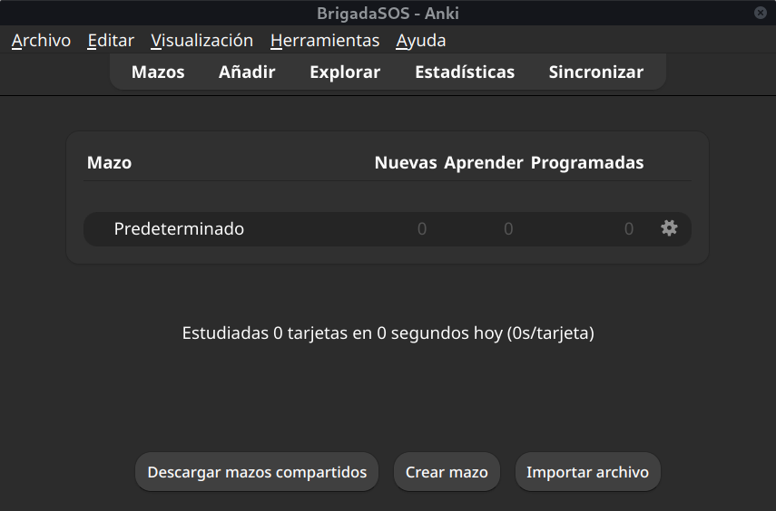

# Anki

## ¿Qué es Anki?
Anki es un programa para crear y estudiar tarjetas virtuales que de forma inteligente va a predecir cuándo es más probable que usted vaya a olvidar cierta información. Cuando eso esté a punto de ocurrir, este mismo le mostrará esa información para que de esa forma pueda retenerla por un periodo de tiempo más largo y, en efecto, cada vez que se le muestre, el intervalo de revisión se hará más y más amplio hasta que ya no le sea necesario recordar esa información. A esta técnica se le conoce como sistema de repetición espaciada (SRS) y por supuesto, Anki hace uso de ella.

Estudiar en Anki consiste de dos componentes: aprender nuevas tarjetas, y repasar tarjetas ya vistas.

Aprender nuevas tarjetas es el primer paso cuando se empieza a usar Anki, memorizar por primera vez el contenido mostrado en la tarjeta es a lo que se le llama aprender nuevas tarjetas. Una vez que se haya memorizado por primera vez el contenido de esa tarjeta, esta se convertirá en una tarjeta de repaso. Cuando se obtienen las primeras tarjetas de repaso Anki creará cada día una lista de tarjetas que están próximas a olvidarse. Estas pueden ser muchas o pocas en un día, pero lo importante es completar los repasos todos los días para disminuir la posibilidad de olvidarlas.

### ¿Por qué utilizarlo?
El principal problema que muchos aprendices enfrentan al momento de aprender vocabulario es la cantidad abismal de palabras que existen en el japonés y en general, casi cualquier idioma. En números rápidos, siendo usted un nativo hispanohablante, probablemente conozca alrededor de ~15000 a ~30000 palabras. Para desenvolverse relativamente bien y con cierta comodidad en un idioma, no siendo exclusivo en el japonés, necesitará conocer alrededor de ~8000 palabras. No solo eso, tal como se vio en la sección de [Vocabulario y Kanji](../principal-guide/Kanji_Vocabulary.md), las palabras están compuestas de kanjis, de conceptos que muchas veces tendrá que aprender.

Entonces, ¿cómo es posible aprender una cantidad abismal de cosas sin tardar años?

### Enfoques intuitivos pero erróneos

### ¿Por qué Anki y no otro SRS?
Anki hoy en día es el mejor programa en el mercado que hace uso del sistema de repetición espaciada por tres razones: es extremadamente personalizable, es multiplataforma y cuenta con un soporte increíble por la comunidad como ningún otro.

### ¿Para qué me servirá Anki y para que no?

**Anki le servirá si:**

✅ Desea acelerar su velocidad para memorizar vocabulario/kanji/gramática.

**Anki no le servirá si:**

❌ Espera aprender japonés dedicando más tiempo a Anki que la inmersión.

❌ No mantiene un hábito de utilizarlo constantemente.

## Instalación
De forma oficial Anki está disponible para Windows, Mac y Linux y puede ser descargado a través de este [sitio web](https://apps.ankiweb.net/) de forma gratuita.

Para dispositivos móviles, Anki ofrece una aplicación oficial en [IOS](https://apps.apple.com/es/app/ankimobile-flashcards/id373493387) que puede ser comprada por 24.99 USD. Para Android existe una aplicación hecha por un tercero, [AnkiDroid](https://play.google.com/store/apps/details?id=com.ichi2.anki&h), que está disponible de forma gratuita.

## Conceptos 
Para poder usar Anki, antes deberá conocer algunos conceptos básicos con los que se encontrará una y otra vez cada vez que utilice esta aplicación.

### Decks

La primera vez que abra Anki se encontrará con esta interfaz, en ella una de las primeras cosas que podrá observar es la lista de decks. Por ahora sólo contará con un deck: "Default". 

Los decks son, en esencia, un grupo de tarjetas. Un deck podrá contener tarjetas de una categoría como lo podrían ser "Vocabulario o "Gramática". Y cada deck podrá contener sus propios ajustes cómo la cantidad de tarjetas que se muestran por día, o la cantidad de tarjetas que quiere aprender por día. Así mismo, usted podrá crear decks o descargar decks hechos por la comunidad.

### Tarjetas
Dentro del deck usted podrá visualizar el conjunto de tarjetas, tarjetas cuyo contenido son notas. Veamoslo en un ejemplo.

Una tarjeta se puede ver de esta forma.

Esta tarjeta se ve así gracias a las notas que conforman esta tarjeta; el frente, la lectura, el glosario, la oración y la imágen.

En resumen, una tarjeta es sólo un conjunto de notas relacionadas que visualizará con frecuencia.

## Configuración

### Preferencias

### Opciones del deck
:::warning OBLIGATORIO
Las últimas versiones de Anki han cambiado la interfaz del menú de opciones del deck de forma significativa. En esta guía usaremos la anterior interfaz, para abrirla debe presionar el botón `SHIFT` mientras da click al botón de opciones.
:::

## Enfoques intuitivos pero erróneos en el aprendizaje de palabras
## Preguntas frequentes
### ¿Cómo interpretar la tasa de retención?
| Porcentaje 	| Interpretación 	|
|---	|---	|
| >95% 	| No necesita usar Anki si su retención se mantiene por encima de esta durante meses. Si es así, considere memorizar cosas más difíciles o dejar de utilizarlo. 	|
| >90% 	| Retención excelente. Esto es común si está empezando con Anki.  	|
| >80% 	| Retención alta.  	|
| >70% 	| Retención normal.  	|
| >60% 	| Retención baja.  	|
| <60% 	| Punto de quiebre. Puede que sus tarjetas no sean lo suficientemente buenas o no esté estudiando en los momentos adecuados, considere dejar de hacer tarjetas nuevas en Anki y analice cómo mejorar su retención. 	|

### ¿Cada cuánto debería usar Anki?

### ¿Debería memorizar cada palabra en Anki?

###