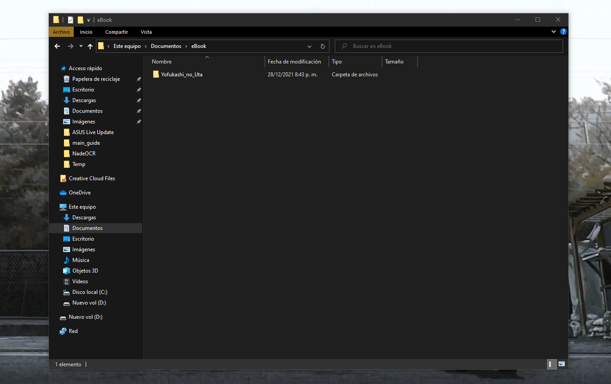

# Lectura en libros electrónicos
**Guía escrita por mm4rk3t**

¿Quiere leer manga y novelas ligeras en su lector de libros electrónicos? Si le interesa, en esta guía le enseñaré a leer scans de mangas o novelas ligeras en su lector de libros electrónicos preferido.

## Requerimientos
- Lector de e-books 
- Software para compresión de archivos `.zip`
- [KindleComicConverter](https://github.com/ciromattia/kcc)
- [Calibre](https://github.com/kovidgoyal/calibre)

:::note Importante
A lo largo de la guía me voy a referir al lector de e-books como Kindle para simplificar la escritura, pero los pasos tambien funcionan para cualquier otro lector. 
:::

## Resumen

A grandes rasgos el proceso consiste en lo siguiente:
1. Obtener un scan
2. Crear un archivo `.zip` y renombrarlo a `.cbz`
3. Crear un archivo `.mobi` con KindleComicConverter
4. Subirlo al lector de e-books con Calibre

*La nitidez de los caracteres depende del PPI de su Kindle (píxeles por pulgada) y la resolución del scan.*

### Paso 1: Obtención del material

Para empezar es necesario que vayas a alguna de las páginas que aparecen en [recursos](https://brigadasos.xyz/utility/Resources/#manga) y te descargues un scan de aquello que quieras leer. En este caso yo voy a descargar Yofukashi no Uta mediante [Nyaa](https://nyaa.si/view/1312881).

### Paso 2: Creación de `.cbz`

:::caution Importante
Si el scan ya está presente en formato `.cbz` puede omitir este paso.
:::

Una vez descargada la carpeta con las imágenes (es necesario que estén ordenadas) tendrás que crear un archivo .zip a partir de las mismas. 

#### Windows
Hay varias herramientas para crear un `zip` en Windows como lo son [7-Zip](https://www.7-zip.org/download.html) o [Winrar](https://www.winrar.es/descargas). Para esta guía usaremos la segunda opción, Winrar.

Los pasos son simples, buscar el directorio, click derecho, opcion añadir al archivo y cambiamos el formato del archivo a `ZIP`.


*<small>Paso a paso para comprimir un archivo en Windows</small>*

#### Linux
Dentro del directorio, usando el comando `zip`: 

```
zip -r yofukashi_no_uta_v01.zip ./
```

--- 

Luego, para ambos casos, tiene que cambiar la extensión .zip por .cbz.

`yofukashi_no_uta_v01.zip` -> `yofukashi_no_uta_v01.cbz`

### Paso 3: Creación de `.mobi`

En este paso vamos a convertir el archivo `.cbz` que creamos antes a un formato que los lectores de e-book puedan entender: `.mobi`.

Para esto vamos a usar **KindleComicConverter**. Una vez abierto, va aparecer la siguiente ventana:


Para obtener el archivo `.mobi` tendrá  que:

1. Añadir el archivo `.cbz` (presionando `Add file` o arrastrándolo dentro de la ventana).
2. Cambiar las opciones para que sean idénticas a las que se muestran en la imagen de arriba. (Dependiendo de la resolución de tu Kindle, tendrás que cambiar `Custom width` y `Custom height`).
3. Darle a `Convert` para obtener el archivo `.mobi`.

Una vez localizado el archivo, puede seguir al próximo paso.

### Paso 4: Subir el archivo al lector de e-books

Finalmente, vamos a usar el software Calibre para subir el scan al Kindle. Primero tiene que añadir el archivo a la librería (presionando `Add books` o arrastrándolo dentro de la ventana) y luego mandarlo al Kindle presionando `Send to device`. 

¡Eso es todo! Lo unico que queda ahora es disfrutar de la lectura.

</img>

*<small>Manga de Berserk visto desde un Kindle Paperwhite (10th Generation)</small>*